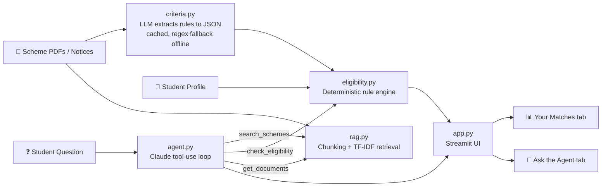

<div align="center">

# 🎓 ScholarSathi

### Agentic RAG Assistant for Scholarship Discovery, Explainable Eligibility Checking and Deadline Tracking

*Enter your profile once. Find every scholarship you qualify for, understand exactly why you don't qualify for the rest, and never miss a deadline again.*


[The Problem](#-the-problem) •
[What Makes It Different](#-what-makes-it-different) •
[Architecture](#%EF%B8%8F-architecture) •
[Quick Start](#-quick-start) •
[Evaluation](#-evaluation) •
[Roadmap](#%EF%B8%8F-limitations-and-roadmap) •
[Viva Prep](#-viva-preparation)

</div>

---

## 📌 The Problem

Every year, thousands of eligible students in India miss out on scholarships and fee waivers. Not because they don't qualify, but because the information is hard to reach and harder to read.

| Pain point | What actually happens |
|---|---|
| 📄 **Scattered rules** | Criteria such as category, family income, course level, minimum marks, gender and domicile are buried in long PDFs across many portals |
| 🧩 **Dense language** | Students misread clauses and wrongly assume they are ineligible |
| 📑 **Hidden document lists** | A missing certificate is discovered only after the window closes |
| ⏰ **Separate deadlines** | Each scheme has its own closing date, with no single place to track them |

### 💡 The Solution

ScholarSathi turns this into a single, guided workflow:

```
 1. 👤 Enter your profile once
 2. 🔍 The system reads every scheme document
 3. ✅ See the schemes you are eligible for, ranked
 4. ❌ See the exact rule that fails for the rest
 5. 📋 Get a document checklist for each match
 6. 🚨 Get warned about deadlines closing soon
```

---

## 🚀 What Makes It Different

ScholarSathi is not a chatbot wrapped around a language model. It separates **reading** from **deciding**, so every answer can be traced back to a document and a rule.

| | Basic chatbot | ScholarSathi |
|---|---|---|
| **Source of truth** | Model memory, prone to hallucinated rules | Official scheme documents via RAG, with the source scheme named |
| **Who decides eligibility** | The LLM | A deterministic Python rule engine. The LLM only *extracts* rules |
| **Auditability** | Opaque | Every decision lists the rules passed and the rule that failed |
| **Interaction** | Single question, single answer | An agent that plans and calls tools: `search_schemes`, `check_eligibility`, `get_documents` |
| **Actions** | None | Ranks matches, counts days left, flags urgent deadlines, builds checklists |

> **🔑 Core design principle**
> *The LLM reads. The rule engine decides.* This hybrid design removes hallucinated eligibility decisions while keeping the flexibility of an LLM for understanding free-form notices.

---

## 🏗️ Architecture



<details>
<summary><b>🧱 Component breakdown (click to expand)</b></summary>

<br>

| Module | Responsibility | Key output |
|---|---|---|
| `criteria.py` | Uses the LLM to convert free-form eligibility text into structured JSON rules. Results are cached. Falls back to regex parsing when offline | Machine-readable criteria per scheme |
| `rag.py` | Splits scheme documents into chunks and retrieves relevant passages with TF-IDF | Grounded context for detail questions |
| `eligibility.py` | Evaluates a profile against each scheme's rules | Passed rules, failed rules, closed status, days left |
| `agent.py` | Runs a Claude tool-use loop that plans, calls tools and writes a grounded answer | Natural-language answer citing the scheme |
| `app.py` | Streamlit interface with two tabs | *Your Matches* and *Ask the Agent* |

</details>

<details>
<summary><b>📴 Offline mode (click to expand)</b></summary>

<br>

No API key? No internet? No problem. Without a key, the same tools run in a **fixed pipeline** instead of the agent loop, so the full demo works offline. Rule extraction falls back to regex parsing of the structured `ELIGIBILITY:` format used in the sample files.

</details>

---

## ⚡ Quick Start

### 1️⃣ Install

```bash
pip install -r requirements.txt
```

### 2️⃣ Run the tests

```bash
python tests/test_scholarsathi.py   # 8 eligibility cases + 5 retrieval cases
```

### 3️⃣ Launch the app

```bash
streamlit run app.py
```

### 4️⃣ (Optional) Enable the LLM agent

```bash
export ANTHROPIC_API_KEY=your_key_here
```

<details>
<summary><b>📂 Adding your own scheme documents</b></summary>

<br>

1. Copy the scheme text from the official portal.
2. Save it as a `.txt` file in `data/schemes/`.
3. Restart the app.

| Mode | What the file needs |
|---|---|
| **With API key** | Free-form text. The LLM extracts the criteria automatically |
| **Without API key** | Must follow the `ELIGIBILITY:` format used in the sample files |

</details>

> ⚠️ **Data note**
> The five files in `data/schemes/` are **fictional sample schemes** created for demonstration. Before presenting this as a real tool, replace them with official notices (for example, from your state scholarship portal) and verify the extracted rules by hand.

---

## 📊 Evaluation

| Test suite | Cases | Result |
|---|:---:|:---:|
| ✅ Eligibility engine (hand-written profile and scheme pairs) | 8 | **8 / 8 correct** |
| ✅ Retrieval (correct scheme returned at rank 1) | 5 | **5 / 5 correct** |
| | **13** | **All passing** |

> 📝 **Honest scope**
> These tests were written by the project author. They demonstrate that the logic works as designed, not that the system is accurate on real-world notices.

<details>
<summary><b>🔬 Proposed stronger evaluation</b></summary>

<br>

1. Collect **30 real scholarship notices** from official portals.
2. **Hand-label** the eligibility rules in each notice as ground truth.
3. Run the LLM extractor and measure **field-level extraction accuracy** (precision and recall per rule type: income, marks, category and so on).
4. Analyse failure cases to improve prompts or add validation rules.

</details>

---

## 🛣️ Limitations and Roadmap

### Current limitations

- 🔑 The LLM agent path needs an API key and was not exercised in the offline test environment.
- 🔤 TF-IDF retrieval matches keywords, not meaning.
- 📝 Sample data is fictional.

### Planned improvements

- [ ] 🧠 Replace TF-IDF with embeddings and a vector database
- [ ] 🌐 Add Marathi and Hindi support
- [ ] 📤 Allow PDF upload directly in the UI
- [ ] 🔔 Send deadline reminders by email or WhatsApp
- [ ] 🕷️ Build a scraper to refresh notices automatically
- [ ] 📏 Run the 30-notice extraction accuracy study

### 🔒 Privacy by design

Student data is sensitive. ScholarSathi follows three principles:

| Principle | In practice |
|---|---|
| **Stay local** | The profile stays on the device |
| **No logging** | Profile data is never written to logs |
| **Data minimisation** | Ask only for the fields the rules actually need |

---

## 🎤 Viva Preparation

*Click each question to reveal a model answer.*

<details>
<summary><b>Q1. Why does a rule engine make the final decision instead of the LLM?</b></summary>

<br>

Eligibility is a yes-or-no decision with real consequences for a student, so it must be **correct, repeatable and explainable**. An LLM can hallucinate a rule or give different answers to the same input. A deterministic rule engine gives the same output every time and records exactly which rule passed or failed, which makes every decision **auditable**. The LLM is used only where it is strong: reading messy, free-form text and turning it into structured rules.

</details>

<details>
<summary><b>Q2. What is RAG and where is it used here?</b></summary>

<br>

**Retrieval-Augmented Generation** means retrieving relevant passages from a document collection and giving them to the model as context, so its answer is grounded in real sources rather than memory. In ScholarSathi, RAG (`rag.py`) answers **detail questions** such as the application process, benefit amounts and required documents, and the answer names the source scheme.

</details>

<details>
<summary><b>Q3. What makes this system agentic?</b></summary>

<br>

The model is not following a fixed script. Given a question, it **decides which tools to call** (`search_schemes`, `check_eligibility`, `get_documents`), looks at the results, and **loops** until it has enough information to write a grounded answer. Planning, tool selection and iteration are what make it an agent rather than a single prompt-and-response.

</details>

<details>
<summary><b>Q4. How would you measure extraction accuracy, and how do you handle a wrong extraction?</b></summary>

<br>

**Measuring:** build a hand-labelled set of real notices (around 30), compare the extracted rules field by field against the labels, and report precision and recall per rule type.

**Handling errors:** cache extracted rules so they can be **reviewed and corrected by hand**, validate values against sensible ranges (for example, marks between 0 and 100), show the source text alongside each rule in the UI so users can verify it, and fall back to "please verify" instead of a confident decision when extraction looks incomplete.

</details>

<details>
<summary><b>Q5. What are the privacy risks of a student profile?</b></summary>

<br>

A profile combines **caste category, family income, gender, domicile and academic records**, which together are sensitive and potentially identifying. Risks include data leaks, misuse for profiling or discrimination, and exposure through logs or third-party APIs. Mitigations: keep the profile on the device, never log it, collect only the fields the rules require, and avoid sending personal details to the LLM when they are not needed for the task.

</details>

---

## 📄 Resume Bullets

<details>
<summary><b>Copy-ready bullets (click to expand)</b></summary>

<br>

- Built **ScholarSathi**, an agentic RAG assistant (Python, scikit-learn, Streamlit, Claude tool-use) that matches students to scholarships and explains eligibility with rule-level reasons.
- Designed a **hybrid architecture** in which an LLM extracts eligibility criteria and a deterministic engine makes the decision, removing hallucinated eligibility outcomes; validated with 13 unit tests.

</details>

---

<div align="center">

**ScholarSathi** · *Helping every eligible student find the support they deserve* 🎓

</div>
